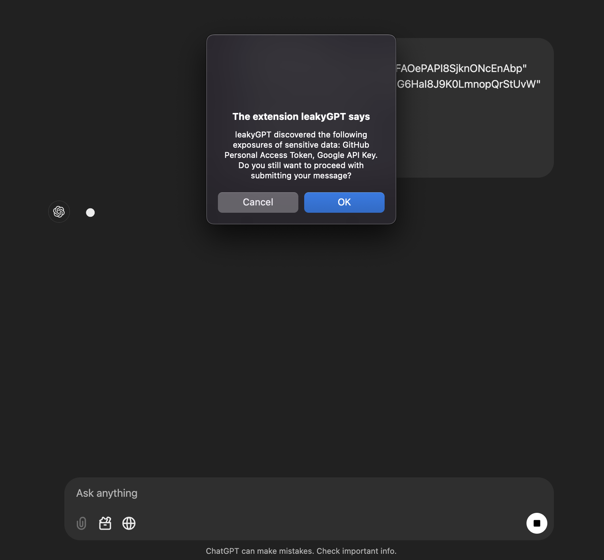

<h1 align="center">leakyGPT 🕸️</h1>

<b>The one-stop extension to prevent any unintended secret exposures while interacting with chatGPT.</b>

  

## Description:
Since OpenAI does <a href="https://help.openai.com/en/articles/5722486-how-your-data-is-used-to-improve-model-performance">admits</a> that they can use our data to train their models, the looming threat of secret leakge as part of user prompts had to be addressed. While OpenAI does take steps to reduce the amount of personal information going into their training datasets, no individual or organization would want their secret keys or tokens to be a part of the training data. This is a major issue for companies whose teams largely depend on ChatGPT for their day-to-day work and could be passing sensitive data as part of their prompts.

Introducing leakyGPT, a browser extension that looks for any secret exposures (with the help of our <a href="./regexes.json">signatures</a>) within user prompts before they are submitted to chatGPT. The user can decide whether to prevent the prompt from being submitted or continue with it, thus helping prevent secrets from accidentally being trained in the datasets.

## Why Is the Extension Not on Chrome Web Store?
The extension uses Manifest version 2 which is deprecated and hence Chrome is no longer accepting such submissions to the chrome web store. While the version is deprecated, it should still work fine on the latest versions of Chrome as long as they continue to support it. In the long run, I plan on rewriting the code to make it compatible to Manifest version 3 and then launch it over Chrome Web Store.

## Does It Log Any Data?
No data is logged in any step or process of this extension making it completely safe for personal or enterprise use. Which also makes me want to state it here that the extension is completely free of cost and will not have any subscription involved for the time being.

## How to Install?
Simply clone or download the repository and then head over to `chrome://extensions/` and click on "Load unpacked" button. After that, just choose the directory containing the source code / project and it should now be imported onto your browser. 

## How to Use?
No additional steps are required after the installation. Just head over to chatGPT and use it like you always do. In case it detects any exposures it will inform you through a dialog box.

## How to Disable/Uninstall?
If you head to `chrome://extensions/` you can either click on "Remove" button to uninstall the extension or click on "Details" button and toggle `off` the extension in case you would like to disable it.

## How to modify/add custom keyword/regex detection?
Open the `regexes.json` file present in the repo folder which you earlier downloaded or cloned, add up new signatures or modify existing one and then head to `chrome://extensions/` to finally click the reload button next to the toggle one.

<h2> Let's Connect! </h2>
If you have any questions or feedback about Genzai or just want to connect with me, feel free to reach out via <a href="https://x.com/0x9747">Twitter/X</a>, <a href="https://in.linkedin.com/in/umair-nehri-49699317a">LinkedIn</a> or <a href="mailto:umairnehri9747@gmail.com">Email</a>.

